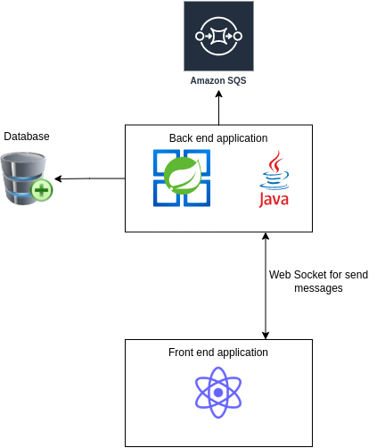

## !!!!Work in progress!!!!

# :envelope: Simple chat application
## :pushpin: Application purpose
 - This application is a simple chat application where you can do the register and add a friend to talk.
 - The purpose of application is improve my skills on Spring Boot, and to learn about WebSocket and Stomp.
 - The back end of application was made using Spring boot, MongoDB and Spock for tests. 
 - The front end of application was made using React and Typescript.

## :wrench: Architecture fluxogram

 
    

## :ballot_box_with_check: Progress of the project

- [x] Save User in MongoDb
- [x] Save sent Message in MongoDb
- [x] Send Message on real time using Web Socket
- [x] Add Friend to send Message
- [ ] Send notification to Friend when User add Friend using Amazon SQS
 
## :computer: Technologies
### :pencil2: Front-end:

### :robot: Back-end:

[Check the front-end repository here :pencil2:](https://github.com/joseMarciano/front-chat-web-socket) 
[Check the front-end repository here :robot:](https://github.com/joseMarciano/chat-web-socket) 
